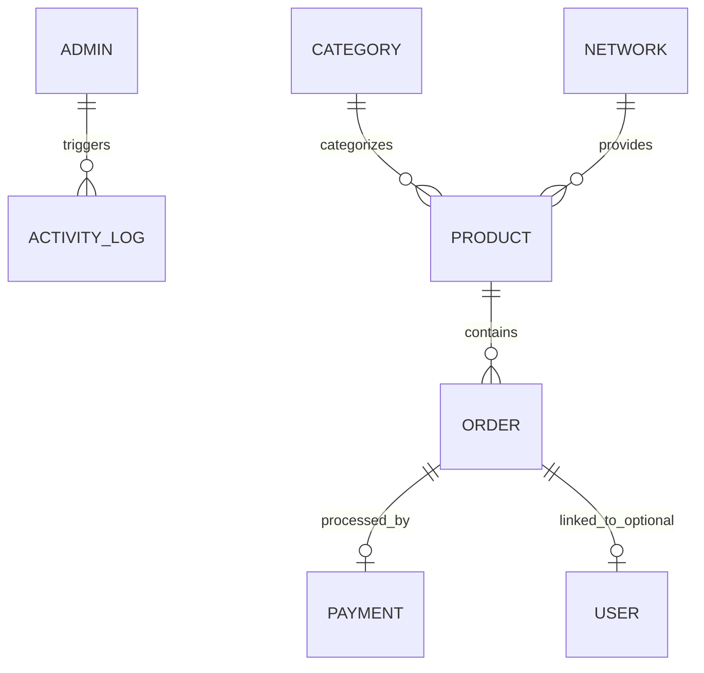

# Database Architecture & ER Diagram

## Entity Relationship Diagram

## Schema Definitions

### 1. Order Model (Guest-Friendly)
Tracks purchases. `userId` is strictly optional.
- `_id`: ObjectId
- `orderReference`: String (Unique)
- `productId`: ObjectId (ref Product)
- `recipientPhone`: String (Required)
- `customerName`: String (Optional)
- `customerPhone`: String (Optional)
- `userId`: ObjectId (ref User, Optional)
- `amount`: Decimal
- `status`: Enum ['PENDING', 'PROCESSING', 'COMPLETED', 'FAILED']
- `paymentReference`: String
- `createdAt`, `updatedAt`: Date

### 2. User Model (Admin & Optional Customer)
- `_id`: ObjectId
- `name`: String
- `email`: String (Unique, Indexed)
- `phone`: String (Unique, Indexed)
- `password`: String (Hashed)
- `role`: Enum ['CUSTOMER', 'ADMIN', 'SUPER_ADMIN']
- `savedNumbers`: Array of Strings (For faster checkout)
- `walletBalance`: Decimal (Default: 0.00)
- `createdAt`: Date

### 3. Product Model
- `_id`: ObjectId
- `categoryId`: ObjectId (ref Category)
- `networkId`: ObjectId (ref Network)
- `name`: String
- `price`: Decimal
- `volume`: String
- `isActive`: Boolean

### 4. Payment Model
- `_id`: ObjectId
- `orderReference`: String
- `reference`: String (Paystack Ref)
- `amount`: Decimal
- `channel`: Enum ['MOMO', 'CARD']
- `status`: Enum ['PENDING', 'SUCCESS', 'FAILED']
- `createdAt`: Date
