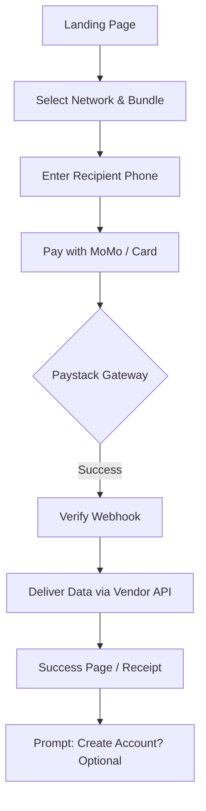
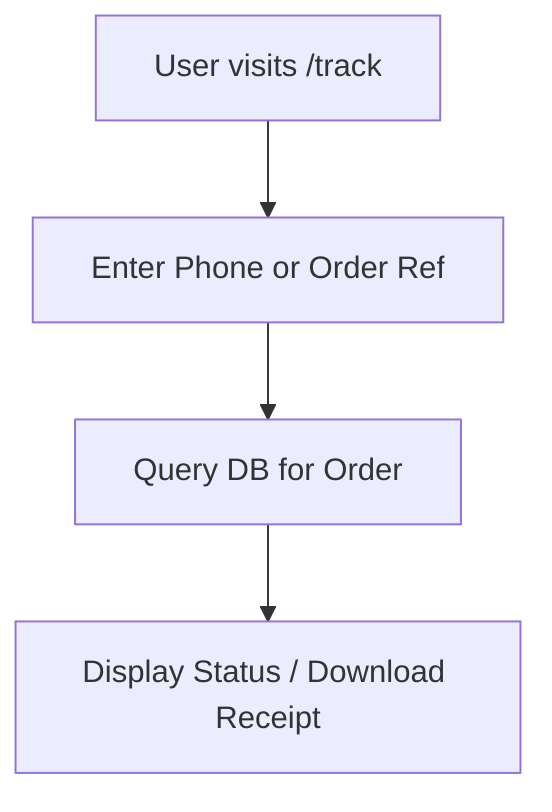
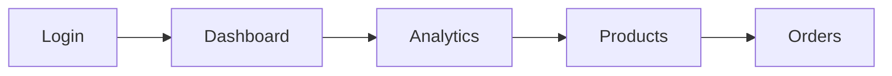

# Application Flows

## 1. Fast Guest Checkout Flow (Default)

```mermaid
graph TD
    A[Landing Page] --> B[Select Network & Bundle]
    B --> C[Enter Recipient Phone]
    C --> D[Pay with MoMo / Card]
    D --> E{Paystack Gateway}
    E -- Success --> F[Verify Webhook]
    F --> G[Deliver Data via Vendor API]
    G --> H[Success Page / Receipt]
    H --> I[Prompt: Create Account? Optional]
```

## 2. Order Tracking Flow

```mermaid
graph TD
    A[User visits /track] --> B[Enter Phone or Order Ref]
    B --> C[Query DB for Order]
    C --> D[Display Status / Download Receipt]
```

## 3. Admin Journey (Requires Auth)

```mermaid
graph LR
    Login --> Dashboard --> Analytics --> Products --> Orders
```
